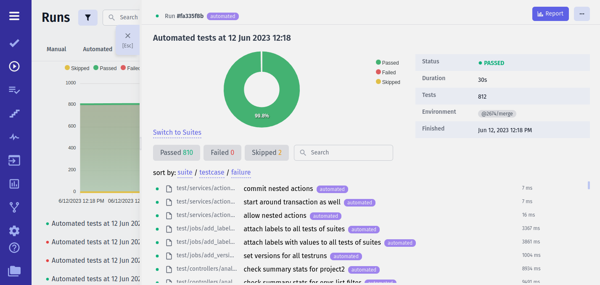

## Testomat.io Pipe



Testomat.io Pipe sends data to [Testomat.io Application](https://app.testomat.io). Testomat.io provides free projects forever and unlimited test runs. Even it is a cloud application you can use it for free.

**🔌 To enable Testomat.io pipe set `TESTOMATIO` environment variable with API key provided by Testomatio.**


```
TESTOMATIO={API_KEY} <actual run command>
```

Here are some possible use cases where you can use additional configuration on reporter:

### Create Unmatched Tests

Testomat.io will not create tests from the report if they have not been previously imported. To create tests during the report `TESTOMATIO_CREATE` option can be used:

```bash
TESTOMATIO={API_KEY} TESTOMATIO_CREATE=1 <actual run command>
```

### Add Report to Run by ID

This feature is widely used when a run is executed on CI.
A run is created before the test is started and it is marked as `scheduled`. Then
a report is assigned to that run using `TESTOMATIO_RUN` environment variable and `{RUN_ID}` of a run:

```bash
TESTOMATIO={API_KEY} TESTOMATIO_RUN={RUN_ID} <actual run command>
```

### Do Not Finalize Run

If multiple reports are added to the same run, each of them should not finalize the run. 
In this case use `TESTOMATIO_PROCEED=1` environment variable, so the Run will be shown as `Running`

```
TESTOMATIO={API_KEY} TESTOMATIO_PROCEED=1 TESTOMATIO_RUN={RUN_ID} <actual run command>
```

After all reports were attached and run can be execute the following command:

```
TESTOMATIO={API_KEY} TESTOMATIO_RUN={RUN_ID} npx start-test-run --finish
```

### Setting Report Title

Give a title to your reports by passing it as environment variable to `TESTOMATIO_TITLE`.

```bash
TESTOMATIO={API_KEY} TESTOMATIO_TITLE="title for the report" <actual run command>
```

### Reporting Parallel Execution to To Same Run

Provide a shared unique title to all runs that will be running in parallel, and add `TESTOMATIO_SHARED_RUN` environment var. So all reports will be sent to this run.

```bash
TESTOMATIO={API_KEY} TESTOMATIO_TITLE="report for commit ${GIT_COMMIT}" TESTOMATIO_SHARED_RUN=1 <actual run command>
```

We recommend using a commit hash as a title to create a new Run. In this case we ensure that run title is unique and will be the same for all parallel jobs running exactly for this commit.


### Adding Report to RunGroup

Create/Add run to group by providing `TESTOMATIO_RUNGROUP_TITLE`:

```sh
TESTOMATIO={API_KEY} TESTOMATIO_RUNGROUP_TITLE="Build ${BUILD_ID}" <actual run command>
```

### Adding Environments to Run

Add environments to run by providing `TESTOMATIO_ENV` as comma seperated values:

```bash
TESTOMATIO={API_KEY} TESTOMATIO_ENV="Windows, Chrome" <actual run command>
```

### Starting an Empty Run

If you want to create a run and obtain its `{RUN_ID}` from [testomat.io](https://testomat.io) you can use `--launch` option:

```bash
TESTOMATIO={API_KEY} npx start-test-run --launch
```

This command will return `{RUN_ID}` which you can pass to other jobs in a workflow.

> When executed with `--launch` a command provided by `-c` flag is ignored

### Manually Finishing Run

If you want to finish a run started by `--launch` use `--finish` option. `TESTOMATIO_RUN` environment variable is required:

```bash
TESTOMATIO={API_KEY} TESTOMATIO_RUN={RUN_ID} npx start-test-run --finish
```
